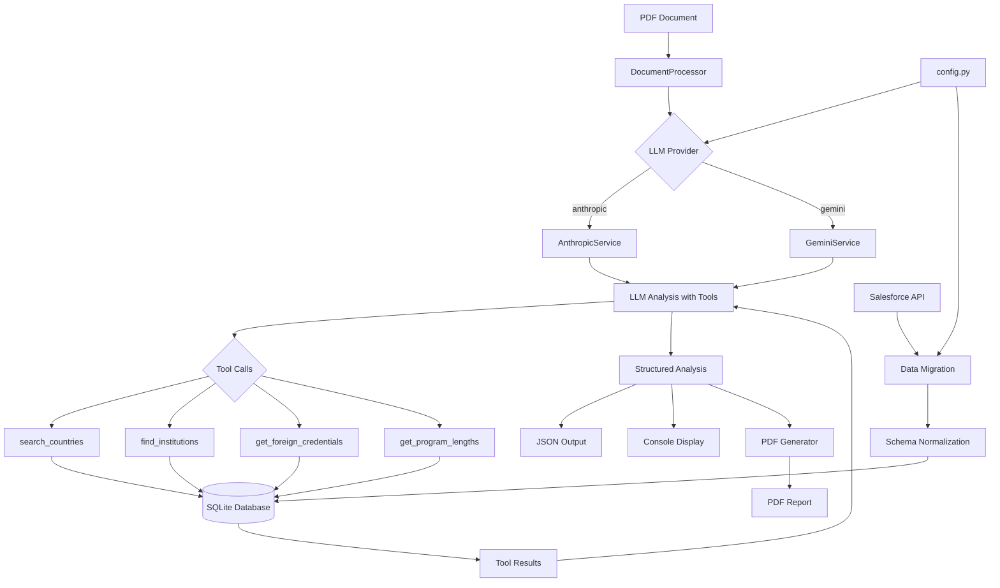

# Evaluator - Educational Credential Analysis System

A modular Python system for extracting educational credentials from Salesforce, normalizing the data into SQLite, performing automated credential analysis on PDF documents using Large Language Models with tool calling capabilities, and generating professional PDF evaluation reports.

## Quick Setup

### Virtual Environment
```bash
# Create virtual environment
python -m venv venv

# Activate (Windows)
venv\Scripts\activate

# Activate (macOS/Linux)
source venv/bin/activate

# Install dependencies
pip install -r requirements.txt
```

### Environment Configuration
Create `.env` file with your credentials:
```env
# Salesforce Configuration
SALESFORCE_USERNAME=your_username
SALESFORCE_PASSWORD=your_password
SALESFORCE_SECURITY_TOKEN=your_token
SALESFORCE_CONSUMER_KEY=your_consumer_key
SALESFORCE_CONSUMER_SECRET=your_consumer_secret

# LLM Configuration - Choose Provider
LLM_PROVIDER=anthropic                   # Options: anthropic, gemini

# Anthropic Configuration
ANTHROPIC_API_KEY=your_api_key
ANTHROPIC_MODEL=claude-sonnet-4-20250514
ANTHROPIC_TIMEOUT=1200.0

# Gemini Configuration  
GEMINI_API_KEY=your_api_key
GEMINI_MODEL=gemini-2.5-flash
GEMINI_TEMPERATURE=0.1
```

## Usage

### Command Line Interface
```bash
# Database Operations
python main.py migrate                    # Extract from Salesforce → Load to SQLite
python main.py reset                      # Drop and recreate all database tables
python main.py stats                      # Display database statistics and integrity

# Credential Analysis
python main.py analyze "filename.pdf" --type general    # Analyze PDF (general evaluation)
python main.py analyze "filename.pdf" --type cbc        # Analyze PDF (course-by-course)

# PDF Report Generation
# The analyze command automatically generates a PDF evaluation report
# Output: results/filename_evaluation_report.pdf
```

### Command Details

| Command | Description | Output |
|---------|-------------|--------|
| `migrate` | Extracts data from Salesforce `Credentials_Form_Setup_Data__c` object and loads into normalized SQLite tables | Console log + `data/evaluator.db` |
| `reset` | Drops all tables and recreates schema (destructive) | Clean database |
| `stats` | Shows record counts and data integrity status | Console statistics |
| `analyze <filename> [--type general\|cbc]` | Processes PDF using LLM + database tools (default: general) | Console output + timestamped JSON + PDF report in `results/` |

### Analysis Output
- **Console**: Human-readable credential analysis with validation status
- **JSON**: Comprehensive results with metadata in `results/YYYYMMDD_HHMMSS_filename.json`
- **PDF Report**: Professional evaluation report in `results/filename_evaluation_report.pdf`

## System Architecture



## Project Structure

```
Evaluator/
├── config.py                           # Environment variables & credentials
├── main.py                             # CLI entry point & orchestration
├── requirements.txt                    # Python dependencies
│
├── data/                               # Database storage
│   └── evaluator.db                   # SQLite database (generated)
│
├── results/                            # Analysis output
│   └── YYYYMMDD_HHMMSS_filename.json  # Timestamped results
│
├── database/                           # Database layer
│   ├── connection.py                  # SQLite connection management
│   ├── schema.py                      # Table definitions (7 tables)
│   ├── migrations.py                  # Salesforce → SQLite ETL
│   └── queries.py                     # Database query utilities
│
├── salesforce/                         # Salesforce integration
│   ├── client.py                      # Authentication & connection
│   └── extractors.py                  # SOQL queries & data extraction
│
├── llm_services/                       # LLM abstraction layer
│   ├── __init__.py                    # Provider factory & service creation
│   ├── base.py                        # Abstract base class
│   ├── anthropic/                     # Anthropic Claude integration
│   │   ├── __init__.py               # Anthropic service exports
│   │   ├── anthropic_service.py      # Claude service implementation
│   │   └── tools.py                  # Anthropic tool schemas
│   └── gemini/                        # Google Gemini integration
│       ├── __init__.py               # Gemini service exports
│       ├── gemini_service.py         # Gemini service implementation
│       └── tools.py                  # Gemini function declarations
│
├── document_processor/                 # PDF analysis orchestration
│   ├── processor.py                   # Main processing pipeline
│   ├── models.py                      # Result data structures
│   ├── pdf_adapter.py                 # Converts analysis to PDF format
│   └── pdf_service.py                 # PDF generation service
│
├── pdf_generator/                      # PDF report generation
│   ├── pdf_generator.py               # Main PDF generation class
│   ├── __init__.py                    # Package exports
│   ├── config/                        # PDF configuration
│   │   └── pdf_config.py             # Layout, fonts, spacing settings
│   ├── core/                          # Core PDF components
│   │   ├── pdf_document.py           # Document management
│   │   ├── font_manager.py           # Font handling
│   │   └── image_manager.py          # Image/background handling
│   ├── types/                         # PDF data types
│   │   └── pdf_types.py              # Pydantic models for PDF data
│   └── utils/                         # PDF utilities
│       └── text_utils.py             # Text processing, wrapping
│
├── prompts/                            # LLM prompts by provider
│   ├── anthropic/                     # Anthropic Claude prompts
│   │   ├── general_instructions.py   # General analysis instructions
│   │   └── cbc_instructions.py       # Course-by-course instructions
│   └── gemini/                        # Google Gemini prompts
│       ├── general_instructions.py   # General analysis instructions
│       ├── cbc_instructions.py       # Course-by-course instructions
│       └── system_instruction.py     # System-level role and behavior
│
├── public/                             # Static resources
│   └── resources/
│       ├── background.png            # PDF background template
│       ├── signature.png             # Signature image
│       └── fonts/                    # Font files (Arial variants)
│
└── utils/                              # Shared utilities
    └── helpers.py                     # Logging, validation, formatters
```

## Database Schema

### Normalized Design
- **Natural Key**: `country_name` as TEXT PRIMARY KEY
- **UUID Keys**: All other tables use UUID4 as TEXT PRIMARY KEY
- **Foreign Keys**: Direct text-based references to country_name

### Tables (7)
1. **`country`** - Master reference table
2. **`foreign_credential`** - Credential types by country
3. **`institution`** - Educational institutions by country
4. **`program_length`** - Program durations by country
5. **`grade_scale`** - Grading systems by country
6. **`us_equivalency`** - US degree equivalencies (standalone)
7. **`notes`** - General notes (standalone)

### Data Source
All tables populated from Salesforce `Credentials_Form_Setup_Data__c` where:
- `Type__c` field determines target table
- `Key__c` contains country name (natural key)
- `Value_1__c` through `Value_5__c` contain typed data

## Implementation Details

### LLM Integration
- **Providers**: Anthropic Claude & Google Gemini (extensible architecture)
- **Provider Selection**: Set via `LLM_PROVIDER` environment variable
- **Tool Calling**: 6 database tools available to all LLMs
- **Context**: Base64 PDF upload + structured prompt
- **Timeout**: 20-minute limit for large documents (Anthropic)
- **Tracking**: Complete conversation metadata with token usage

#### Anthropic Claude Service
- **Manual Tool Calling**: Full control over function execution cycle
- **Iterative Process**: Model → Tool Call → Execution → Result → Model
- **Conversation Management**: Manual tracking of multi-turn interactions
- **Token Tracking**: Detailed input/output token usage monitoring

#### Google Gemini Service  
- **Manual Function Calling**: Full control over function execution cycle (AFC disabled)
- **Iterative Process**: Model → Function Call → Execution → Result → Model (same as Anthropic)
- **Conversation Management**: Manual tracking of multi-turn interactions
- **Token Tracking**: Detailed input/output token usage monitoring
- **Tool Call Tracking**: Complete audit trail of function calls with parameters, results, and timing
- **Why Manual over AFC**: Provides detailed tracking and monitoring required for analysis transparency

### Available Tools for LLM
1. **`search_countries(query)`** - Fuzzy country name matching
2. **`find_institutions(country_name, query)`** - Institution search within country
3. **`get_foreign_credentials(country_name)`** - Available credential types
4. **`get_program_lengths(country_name)`** - Typical program durations
5. **`get_grade_scales(country_name)`** - Grading systems by country
6. **`get_us_equivalencies()`** - All US degree equivalencies and descriptions

### Data Flow
1. **PDF Upload** → Base64 encoding → Claude API
2. **LLM Analysis** → Tool calls → Database queries → Results aggregation
3. **Output Generation** → Structured JSON + Human-readable console
4. **Metadata Capture** → Tool calls, token usage, timing, parameters

### Key Features
- **Modular Architecture**: Separated concerns (DB, Salesforce, LLM, Processing, PDF Generation)
- **Comprehensive Logging**: DEBUG/INFO levels with structured output
- **Error Handling**: Graceful failures with detailed error reporting
- **Extensible**: Abstract base classes for multiple LLM providers
- **Production Ready**: Robust connection management, retry logic, validation
- **Professional PDF Reports**: Automated generation of formatted evaluation reports

## PDF Report Generation

### Features
- **Automatic Generation**: PDF reports are created automatically after each credential analysis


### Report Sections
1. **Header**: Date, case number, student information, evaluation type
2. **Credentials Summary**: Highlighted box with US equivalency statement
3. **Credential Details**: Country, institution, program, length, and equivalency for each credential
4. **Comments**: NACES membership notice and authentication requirements
5. **Policy Statements**: Comprehensive evaluation policies and grade conversion information

### PDF Technical Details
- **Engine**: ReportLab for PDF generation
- **Fonts**: Arial family with bold and italic variants
- **Background**: Custom SpanTran template with watermark
- **Page Size**: Standard US Letter (8.5" x 11")
- **Margins**: Consistent margins with proper text boundaries

## Technical Specifications

### Dependencies
- **Core**: `simple-salesforce`, `anthropic`, `google-genai`
- **Database**: SQLite (built-in)
- **PDF Generation**: `reportlab`, `pypdf`, `Pillow`
- **Data Models**: `pydantic`
- **Utilities**: `python-dotenv`, `pathlib`


### Monitoring
- **Token Tracking**: Input/output tokens per interaction
- **Tool Metrics**: Execution time, success/failure rates
- **Conversation Flow**: Complete audit trail of LLM interactions

## Development

### Adding LLM Providers
1. Create new provider folder in `llm_services/`
2. Extend `BaseLLMService` with provider-specific implementation
3. Implement required methods: `analyze_pdf_document()`, `get_model_info()`
4. Add provider to `create_llm_service()` factory in `llm_services/__init__.py`
5. Add provider-specific configuration to `config.py`
6. Add provider-specific prompts in `prompts/`

### Adding Database Tools
1. Add method to `DatabaseTools` class in `llm_services/tools.py`
2. Define schema in `TOOL_SCHEMAS`
3. Update `tool_map` in `execute_tool()`
4. Update prompt documentation

### Database Schema Changes
1. Modify table definitions in `database/schema.py`
2. Update migration logic in `database/migrations.py`
3. Add queries to `database/queries.py`
4. Update project structure documentation

## Recent Updates

### August 2025
- **Multi-Provider Support**: Added Google Gemini as alternative to Anthropic Claude
- **LLM Service Restructure**: Organized providers into separate modules with shared base class
- **Automatic Function Calling**: Gemini integration with AFC for streamlined tool execution
- **Provider Switching**: Dynamic LLM provider selection via environment variable
- **Enhanced Tool Set**: Added grade scales tool for more comprehensive credential analysis

### November 2024
- **PDF Generation**: Added automated PDF report generation for all credential analyses
- **Text Wrapping**: Implemented intelligent text wrapping to prevent content overflow
- **Font Styling**: Added proper bold/italic formatting for credential details
- **Layout Fixes**: Fixed box width calculations and label/value spacing
- **Multi-page Support**: Added automatic page breaks with proper numbering
- **Template Integration**: Integrated SpanTran-branded background template

## TODO - Future Improvements

### Data Validation & Security
- **LLM Output Validation**: Currently the system trusts the LLM to accurately populate `validated_name`/`validated_type` fields from database tool responses. There's no technical enforcement preventing the LLM from fabricating values that end up on the PDF. Need to implement cross-reference validation between LLM output and actual tool call responses within conversation metadata to ensure database integrity.