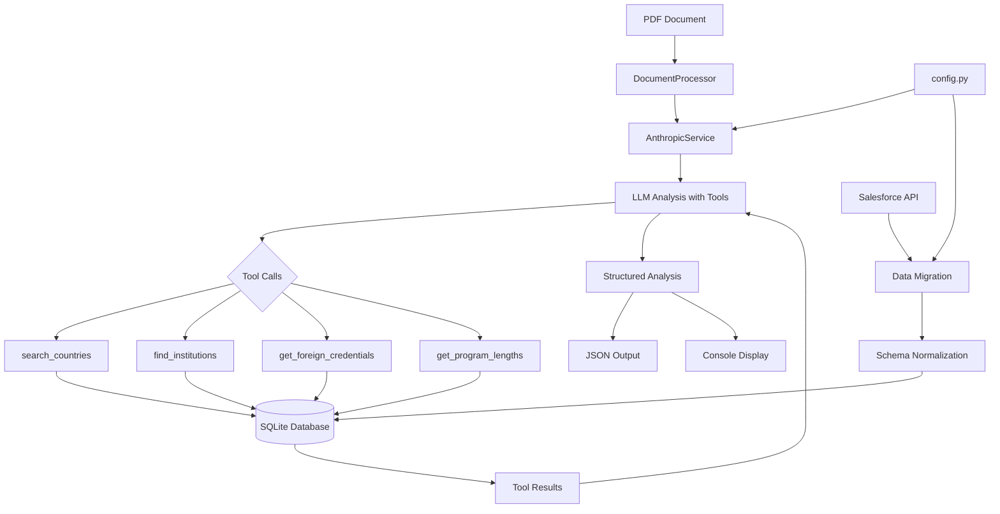

# Evaluator - Educational Credential Analysis System

A modular Python system for extracting educational credentials from Salesforce, normalizing the data into SQLite, and performing automated credential analysis on PDF documents using Large Language Models with tool calling capabilities.

## Quick Setup

### Virtual Environment
```bash
# Create virtual environment
python -m venv venv

# Activate (Windows)
venv\Scripts\activate

# Activate (macOS/Linux)
source venv/bin/activate

# Install dependencies
pip install -r requirements.txt
```

### Environment Configuration
Create `.env` file with your credentials:
```env
# Salesforce Configuration
SALESFORCE_USERNAME=your_username
SALESFORCE_PASSWORD=your_password
SALESFORCE_SECURITY_TOKEN=your_token
SALESFORCE_CONSUMER_KEY=your_consumer_key
SALESFORCE_CONSUMER_SECRET=your_consumer_secret

# LLM Configuration
LLM_PROVIDER=anthropic
ANTHROPIC_API_KEY=your_api_key
ANTHROPIC_MODEL=claude-sonnet-4-20250514
ANTHROPIC_TIMEOUT=1200.0
```

## Usage

### Command Line Interface
```bash
# Database Operations
python main.py migrate                    # Extract from Salesforce → Load to SQLite
python main.py reset                      # Drop and recreate all database tables
python main.py stats                      # Display database statistics and integrity

# Credential Analysis
python main.py analyze "filename.pdf"    # Analyze single PDF folio
```

### Command Details

| Command | Description | Output |
|---------|-------------|--------|
| `migrate` | Extracts data from Salesforce `Credentials_Form_Setup_Data__c` object and loads into normalized SQLite tables | Console log + `data/evaluator.db` |
| `reset` | Drops all tables and recreates schema (destructive) | Clean database |
| `stats` | Shows record counts and data integrity status | Console statistics |
| `analyze <filename>` | Processes PDF using LLM + database tools | Console output + timestamped JSON in `results/` |

### Analysis Output
- **Console**: Human-readable credential analysis with validation status
- **JSON**: Comprehensive results with metadata in `results/YYYYMMDD_HHMMSS_filename.json`

## System Architecture



## Project Structure

```
Evaluator/
├── config.py                           # Environment variables & credentials
├── main.py                             # CLI entry point & orchestration
├── requirements.txt                    # Python dependencies
│
├── data/                               # Database storage
│   └── evaluator.db                   # SQLite database (generated)
│
├── results/                            # Analysis output
│   └── YYYYMMDD_HHMMSS_filename.json  # Timestamped results
│
├── database/                           # Database layer
│   ├── connection.py                  # SQLite connection management
│   ├── schema.py                      # Table definitions (7 tables)
│   ├── migrations.py                  # Salesforce → SQLite ETL
│   └── queries.py                     # Database query utilities
│
├── salesforce/                         # Salesforce integration
│   ├── client.py                      # Authentication & connection
│   └── extractors.py                  # SOQL queries & data extraction
│
├── llm_services/                       # LLM abstraction layer
│   ├── base.py                        # Abstract base class
│   ├── anthropic_service.py           # Claude integration
│   └── tools.py                       # Database tool definitions
│
├── document_processor/                 # PDF analysis orchestration
│   ├── processor.py                   # Main processing pipeline
│   └── models.py                      # Result data structures
│
├── prompts/                            # LLM prompts by provider
│   └── anthropic/
│       └── credential_analysis.py     # Claude analysis prompt
│
└── utils/                              # Shared utilities
    └── helpers.py                     # Logging, validation, formatters
```

## Database Schema

### Normalized Design
- **Natural Key**: `country_name` as TEXT PRIMARY KEY
- **UUID Keys**: All other tables use UUID4 as TEXT PRIMARY KEY
- **Foreign Keys**: Direct text-based references to country_name

### Tables (7)
1. **`country`** - Master reference table
2. **`foreign_credential`** - Credential types by country
3. **`institution`** - Educational institutions by country
4. **`program_length`** - Program durations by country
5. **`grade_scale`** - Grading systems by country
6. **`us_equivalency`** - US degree equivalencies (standalone)
7. **`notes`** - General notes (standalone)

### Data Source
All tables populated from Salesforce `Credentials_Form_Setup_Data__c` where:
- `Type__c` field determines target table
- `Key__c` contains country name (natural key)
- `Value_1__c` through `Value_5__c` contain typed data

## Implementation Details

### LLM Integration
- **Provider**: Anthropic Claude (extensible architecture)
- **Tool Calling**: 4 database tools available to LLM
- **Context**: Base64 PDF upload + structured prompt
- **Timeout**: 20-minute limit for large documents
- **Tracking**: Complete conversation metadata with token usage

### Available Tools for LLM
1. **`search_countries(query)`** - Fuzzy country name matching
2. **`find_institutions(country_name, query)`** - Institution search within country
3. **`get_foreign_credentials(country_name)`** - Available credential types
4. **`get_program_lengths(country_name)`** - Typical program durations

### Data Flow
1. **PDF Upload** → Base64 encoding → Claude API
2. **LLM Analysis** → Tool calls → Database queries → Results aggregation
3. **Output Generation** → Structured JSON + Human-readable console
4. **Metadata Capture** → Tool calls, token usage, timing, parameters

### Key Features
- **Modular Architecture**: Separated concerns (DB, Salesforce, LLM, Processing)
- **Comprehensive Logging**: DEBUG/INFO levels with structured output
- **Error Handling**: Graceful failures with detailed error reporting
- **Extensible**: Abstract base classes for multiple LLM providers
- **Production Ready**: Robust connection management, retry logic, validation

## Technical Specifications

### Dependencies
- **Core**: `simple-salesforce`, `anthropic`
- **Database**: SQLite (built-in)
- **Utilities**: `python-dotenv`, `pathlib`


### Monitoring
- **Token Tracking**: Input/output tokens per interaction
- **Tool Metrics**: Execution time, success/failure rates
- **Conversation Flow**: Complete audit trail of LLM interactions

## Development

### Adding LLM Providers
1. Extend `BaseLLMService` in `llm_services/`
2. Implement required methods
3. Add provider-specific prompts in `prompts/`
4. Update `DocumentProcessor` initialization

### Adding Database Tools
1. Add method to `DatabaseTools` class in `llm_services/tools.py`
2. Define schema in `TOOL_SCHEMAS`
3. Update `tool_map` in `execute_tool()`
4. Update prompt documentation

### Database Schema Changes
1. Modify table definitions in `database/schema.py`
2. Update migration logic in `database/migrations.py`
3. Add queries to `database/queries.py`
4. Update project structure documentation